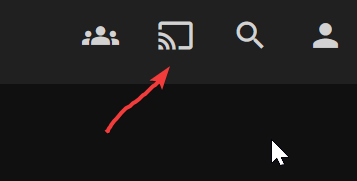
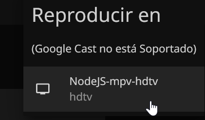
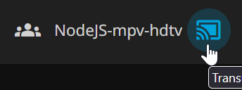
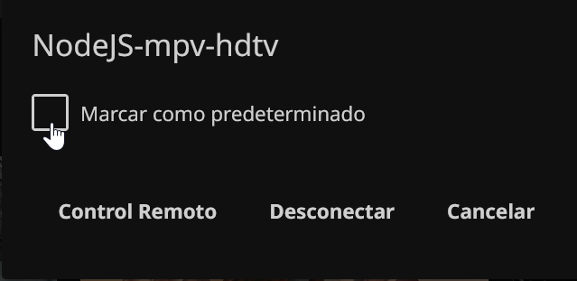

# 🎬 Jellyfin MPV Play

Control your **MPV player** from the **Jellyfin web interface**. Play movies and series with hardware acceleration and resume from where you left off.


_Control MPV directly from Jellyfin's web interface_

---

## ✨ Features

- 🎯 **Remote Control** - Play from any device on your network
- 💾 **Auto-Resume** - Continue watching from where you stopped
- ⏭️ **Auto-Play Next Episode** - Binge-watch series seamlessly
- ⚡ **Hardware Acceleration** - Smooth playback with MPV
- 🔄 **Auto-Reconnect** - Handles network interruptions

---

## 📋 What You Need

Before starting, make sure you have:

1. **Node.js** (v14 or newer) - [Download here](https://nodejs.org/)
2. **MPV Player** - [Download here](https://mpv.io/installation/)
3. **Jellyfin Server** - Your server URL and login credentials

---

## 🚀 Quick Start

### 1️⃣ Download & Install
```bash
# Clone the repository
git clone https://github.com/JohnGlaus/Jellyfin_mpv_play.git
cd Jellyfin_mpv_play

# Install dependencies
npm install
```

### 2️⃣ Configure
```bash
# Copy the example config
copy config.example.js config.js

# Edit config.js with your details
notepad config.js
```

**Fill in your information:**
```javascript
module.exports = {
    serverUrl: 'http://192.168.1.100:8096',  // Your Jellyfin server
    username: 'your_username',                // Your Jellyfin username
    password: 'your_password',                // Your Jellyfin password
    mpvPath: 'C:\\MPV\\mpv.exe',             // Path to MPV
    deviceName: 'Living-Room-PC',            // Any name you want
    deviceId: '',                            // Leave empty
    ipcSocketPath: '\\\\.\\pipe\\mpv-ipc'   // Leave as-is
};
```

> **💡 Tip:** Use double backslashes `\\` in Windows paths

### 3️⃣ Run
```bash
npm start
```

You should see:
```
✅ WebSocket connection established
💡 Open Jellyfin in your browser and use "Play on" to select this device
```

---

## 🎮 How to Use

### Step 1: Start the application
Run `npm start` in your project folder

### Step 2: Open Jellyfin
Open Jellyfin in your web browser

### Step 3: Choose your device
### Step 3: Choose your device
Select your device from the list (the name you set in `config.js`)

<div align="center">
  
  
</div>
<div align="center">
  
  
</div>
_Your device will appear in the list_

### Step 4: Select content
Choose any movie or episode

### Step 5: Click "Play on"
Click the cast icon (📺) or "Play on" button


_Click the "Play on" button in Jellyfin_

### Step 6: Choose your device
Select your device from the list (the name you set in `config.js`)


_Your device will appear in the list_

### Step 7: Enjoy!
MPV will open automatically and start playing 🎉


_Content playing in MPV_

---

## ⌨️ Keyboard Shortcuts

While watching in MPV:

| Key | Action |
|-----|--------|
| `Space` | Pause/Resume |
| `>` or `Media Next` | Next episode |
| `<` or `Media Previous` | Previous episode |
| `←` / `→` | Seek backward/forward |
| `V` | Cycle subtitles |
| `Q` | Stop playback |

---

## 🔄 Auto-Start on Windows (Optional)

Want the app to start automatically when Windows boots?

### Create `start.bat`

Create a file named `start.bat` in the project folder:
```batch
@echo off
cd /d "C:\_ELECTRON\jellyfin_mpv_play"
node shim.js
```

> ⚠️ **Change the path** to match your installation folder

### Create `start.vbs`

Create a file named `start.vbs` (runs silently without showing a window):
```vbscript
Set WshShell = CreateObject("WScript.Shell") 
WshShell.Run chr(34) & "C:\_ELECTRON\jellyfin_mpv_play\start.bat" & Chr(34), 0
Set WshShell = Nothing
```

> ⚠️ **Change the path** to match your `start.bat` location

### Add to Startup

1. Press `Win + R`
2. Type: `shell:startup` and press Enter
3. Create a **shortcut** to `start.vbs`
4. Move the shortcut to the Startup folder

---

## 🛠️ Troubleshooting

### "config.js file not found"
- Run: `copy config.example.js config.js`
- Edit `config.js` with your details

### MPV doesn't open
- Check `mpvPath` in `config.js` points to the correct location
- Test MPV manually: Run `mpv --version` in CMD

### Device doesn't appear in Jellyfin
- Verify `serverUrl` is correct
- Check username and password
- Make sure your PC and Jellyfin server are on the same network

### Playback doesn't resume
- Wait at least 10 seconds before closing MPV
- Resume data is saved in the `data/` folder

---

## 📁 Project Structure
```
jellyfin_mpv_play/
├── data/                  # Tokens & positions (auto-generated)
├── images/                # Screenshots for README
├── node_modules/          # Dependencies
├── .gitignore
├── config.example.js      # Configuration template
├── config.js              # Your config (don't share!)
├── package.json
├── README.md
└── shim.js                # Main application
```

---

## 🔒 Security

- ⚠️ **Never share `config.js`** - it contains your password
- 🔐 Your password is only used to authenticate with Jellyfin
- 💾 Tokens are stored locally in the `data/` folder

---

## 🤝 Contributing

Found a bug? Have a suggestion?

- Open an [Issue](https://github.com/JohnGlaus/Jellyfin_mpv_play/issues)
- Submit a Pull Request

---

## 📄 License

MIT License - Feel free to use and modify!

---

## ❓ FAQ

**Q: Does this work on Linux/Mac?**  
A: Yes! Just change the paths in `config.js` (use `/` instead of `\\`)

**Q: Can I use this over the internet?**  
A: Yes, if your Jellyfin server is accessible, but LAN is recommended

**Q: Can I run multiple instances?**  
A: Yes, use different `deviceId` and `ipcSocketPath` for each

---

**Made with ❤️ for the Jellyfin community**

⭐ **Star this repo** if you find it useful!